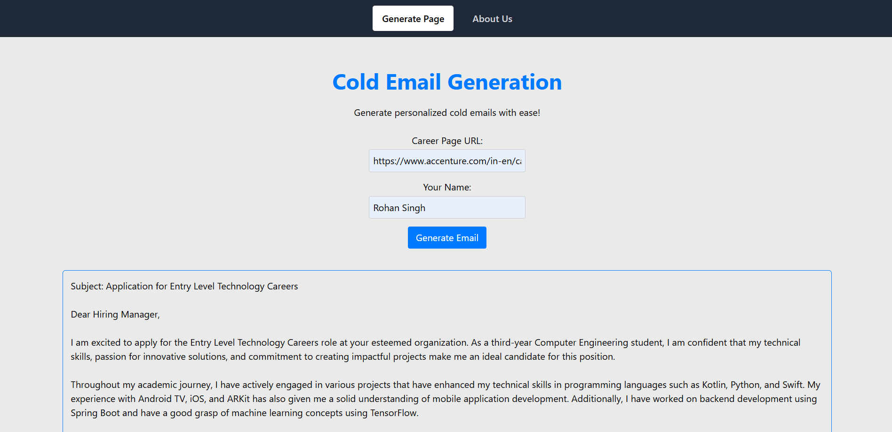

# Cold Email Generator

A powerful web application designed to automate personalized cold email generation. Using LangChain and Python with a React frontend, this tool scrapes job information from career pages and matches job requirements with your portfolio. It generates tailored cold emails, helping users make impactful first impressions.



## Table of Contents

- [Features](#features)
- [Demo](#demo)
- [Installation](#installation)
- [Usage](#usage)
- [Folder Structure](#folder-structure)
- [Environment Setup](#environment-setup)
- [Contributing](#contributing)
- [License](#license)

## Features

- **Job Posting Extraction:** Scrapes job postings from provided career page URLs.
- **Portfolio Matching:** Matches job skills with portfolio items to highlight relevant projects.
- **Cold Email Generation:** Generates personalized cold emails based on job descriptions and user details.
- **Responsive Design:** Fully responsive with a smooth and clean user interface.

## Demo

Watch the full video tutorial and walkthrough [here](https://youtu.be/-_sGLbRLYZU).

[](https://youtu.be/-_sGLbRLYZU)

## Installation

### Prerequisites

- [Node.js](https://nodejs.org/) (v14 or higher)
- [Python 3.x](https://www.python.org/)
- [Flask](https://flask.palletsprojects.com/)
- [ngrok](https://ngrok.com/) (for public URL access)

### Backend Setup

1. Clone the repository:
   ```bash
   git clone https://github.com/singhvishalrajput/Cold_Email_Generator.git
   cd Cold_Email_Generator
   ```

2. Install Python dependencies:
   ```bash
   pip install -r requirements.txt
   ```

3. Set up your `ngrok` token and API keys:
   - Generate your ngrok authentication token and API keys for LangChain. Replace `{......write_your_authtoken_here....}` and `....add_your_api_key.....` in `script.ipynb`.

4. Run the Flask server:
   ```bash
   python script.ipynb
   ```

### Frontend Setup

1. Navigate to the `job-scraper-react` directory:
   ```bash
   cd job-scraper-react
   ```

2. Install React dependencies:
   ```bash
   npm install
   ```

3. Run the React application:
   ```bash
   npm start
   ```

## Usage

1. Access the React app at `http://localhost:3000`.
2. Enter the career page URL and your name to generate personalized cold emails for job applications.
3. Review the generated email in the response section and make adjustments as needed.

## Folder Structure

```plaintext
Cold_Email_Generator/
├── google_collab/
│   └── script.ipynb
├── job-scraper-react/
│   ├── node_modules/
│   ├── public/
│   ├── src/
│   │   ├── components/
│   │   ├── JS/
│   │   └── css/
│   └── package.json
├── assets/
│   └── website_image.png
└── README.md
```

## Environment Setup

1. **LangChain API Key**: Generate an API key for LangChain and add it to `script.ipynb` under `groq_api_key`.
2. **ngrok Token**: Obtain an ngrok token and add it to `script.ipynb`.

*Note: Make sure to generate your own tokens and keys, as the project does not include any.*

## Contributing

We welcome contributions! Please follow these steps:
1. Fork the repository.
2. Create a new branch (`feature/your-feature-name`).
3. Commit your changes.
4. Push to the branch.
5. Open a pull request.

## License

This project is licensed under the MIT License.

